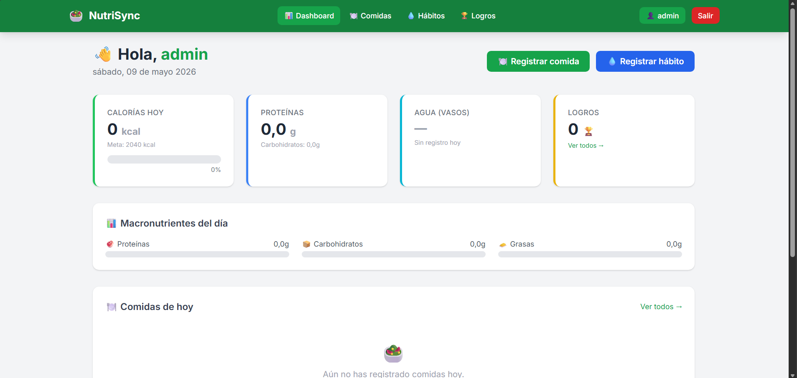

# NutriSync - Control Nutricional y Tracking de Hábitos

Plataforma web basada en **Django** con arquitectura **MVT** para el registro nutricional, control de calorías y tracking de hábitos saludables.

Este proyecto se ejecuta en un entorno de desarrollo en contenedores (Docker) que incluye la aplicación web, una base de datos PostgreSQL y la herramienta gráfica pgAdmin4.

---

## 🚀 Requisitos Previos

Asegúrate de tener instalado lo siguiente en tu sistema antes de comenzar:

* **Docker Desktop** (Debe estar ejecutándose)
* **Git** (Para clonar/actualizar el repositorio)

---

## 🛠️ Instrucciones de Instalación y Ejecución

Sigue estos pasos en orden para levantar el proyecto por primera vez:

### 1. Levantar los contenedores

Abre una terminal en la raíz del proyecto (donde se encuentra el archivo `docker-compose.yml`) y ejecuta:

```bash
docker compose up -d --build
```

> *Nota: Este comando descarga las imágenes (Python, Postgres, pgAdmin), instala las dependencias (Django, etc.) y arranca los contenedores en segundo plano.*

### 2. Aplicar las migraciones a la Base de Datos

Una vez que los contenedores estén corriendo, debes crear las tablas en PostgreSQL ejecutando:

```bash
docker exec -it nutrisync_web python manage.py migrate
```

### 3. Cargar datos iniciales y crear al Superusuario

Para tener el sistema listo con la lista oficial de alimentos (requerida por el proyecto) y la cuenta de administrador, ejecuta el script de inicialización:

```bash
docker exec -it nutrisync_web python setup_db.py
```

> *Este script creará al superusuario (admin/admin) y cargará los 15 alimentos base en la tabla Alimentos.*

---

## 🌐 Enlaces de Acceso

Una vez levantado y configurado el entorno, puedes acceder a las plataformas desde tu navegador:

### 1. Aplicación Web / Panel de Administración Django

* **URL:** [http://localhost:8000/admin/](http://localhost:8000/admin/)
* **Usuario:** `admin`
* **Contraseña:** `admin`

### 2. Gestor de Base de Datos (pgAdmin4)

* **URL:** [http://localhost:5050/](http://localhost:5050/)
* **Email:** `admin@admin.com`
* **Contraseña:** `admin`

#### ¿Cómo conectar pgAdmin a la base de datos PostgreSQL por primera vez?

Cuando entres a pgAdmin por primera vez, deberás registrar el servidor:

1. Haz clic derecho en **"Servers"** > **"Register"** > **"Server..."**.
2. En la pestaña **General**, ponle como nombre `NutriSync DB`.
3. En la pestaña **Connection**, llena los datos exactamente así:
   * **Host name/address:** `nutrisync_db`
   * **Port:** `5432`
   * **Maintenance database:** `nutricion_db`
   * **Username:** `postgres`
   * **Password:** `postgres`
   * Marca la casilla **"Save password?"** y haz clic en **Save**.

La tabla de alimentos la encontrarás navegando por:
`Servers` > `NutriSync DB` > `Databases` > `nutricion_db` > `Schemas` > `public` > `Tables` > `alimentos_alimento`.

---

## 🛑 Cómo detener el proyecto

Para apagar los contenedores sin perder tus datos de la base de datos, ejecuta en la consola:

```bash
docker compose stop
```

Si deseas destruir los contenedores (las bases de datos persistirán en los volúmenes), usa:

```bash
docker compose down
```

## 📝 Explicación de `setup_db.py`

El archivo `setup_db.py` es un script autónomo escrito en Python que utilizamos para inicializar la base de datos. Su funcionamiento es el siguiente:

1. **Carga el Entorno de Django:** Configura las variables de entorno (`django.setup()`) para que el script pueda comunicarse con la base de datos a través del ORM de Django como si fuera parte de la aplicación web.
2. **Crea el Superusuario:** Utiliza el modelo de usuarios de Django para buscar o crear de forma automática la cuenta administrativa (`admin` / `admin`).
3. **Pobla los Datos Iniciales (Seeding):** Contiene una lista en código (matriz) con los 15 alimentos base exigidos por los requerimientos del proyecto. Mediante un bucle, utiliza `get_or_create` para insertarlos en PostgreSQL de forma segura, garantizando que no se dupliquen si alguien ejecuta el script múltiples veces.

---

## 🛠️ Resolución de Problemas Comunes (Troubleshooting)

Si tú o tus compañeros se encuentran con algún problema al levantar o usar el entorno, utilicen los siguientes comandos para solucionarlo rápidamente:

### 1. La página web no carga (`Connection refused` o error de conexión a la base de datos)

* **Causa:** Cuando los contenedores se crean por primera vez, el servidor de Django (`web`) puede iniciar más rápido de lo que PostgreSQL (`db`) tarda en inicializar su base de datos, provocando un fallo en la conexión inicial de Django.
* **Solución:** Una vez que la base de datos esté lista para recibir conexiones, simplemente reinicia el contenedor de Django ejecutando:

  ```bash
  docker compose restart web
  ```

### 2. Error `relation "django_session" does not exist` o errores similares en la base de datos

* **Causa:** Las tablas de la base de datos aún no se han creado en PostgreSQL.
* **Solución:** Ejecuta las migraciones de Django para crear el esquema de base de datos correspondiente:

  ```bash
  docker compose exec web python manage.py migrate
  ```

### 3. ¿Cómo ver los logs del sistema en tiempo real para diagnosticar errores?

* **Ver logs de todos los servicios simultáneamente:**

  ```bash
  docker compose logs -f
  ```

* **Ver solo los logs del servidor Django (Web):**

  ```bash
  docker compose logs -f web
  ```

* **Ver solo los logs de la base de datos (PostgreSQL):**

  ```bash
  docker compose logs -f db
  ```

### 4. Volver a poblar la base de datos o recrear el superusuario

* **Solución:** Si necesitas restaurar los 15 alimentos base o asegurarte de que el usuario `admin` esté creado correctamente, vuelve a ejecutar el script de inicialización de la base de datos:

  ```bash
  docker compose exec web python setup_db.py
  ```

---

## 📸 Vista Previa del Sistema

